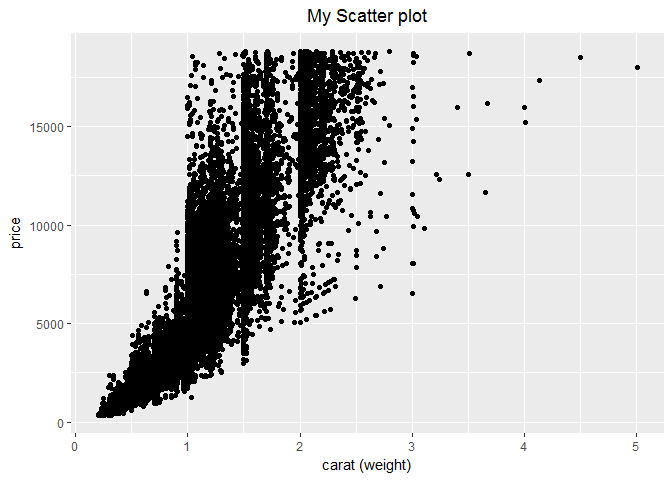
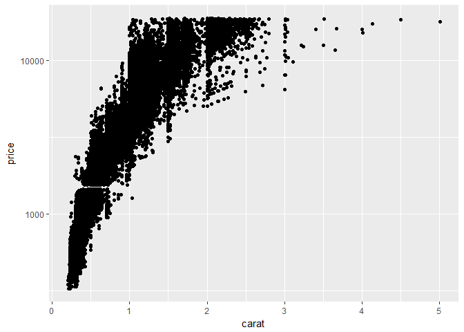
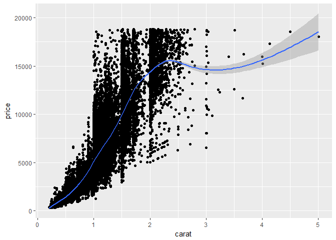
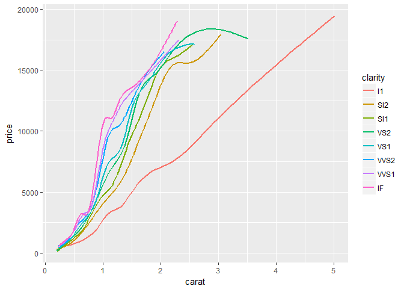
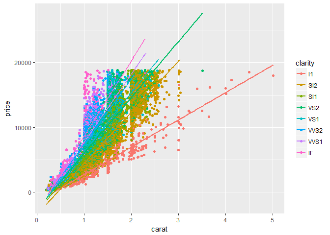
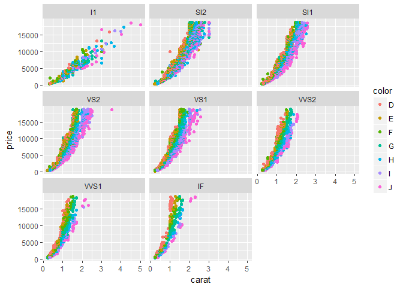
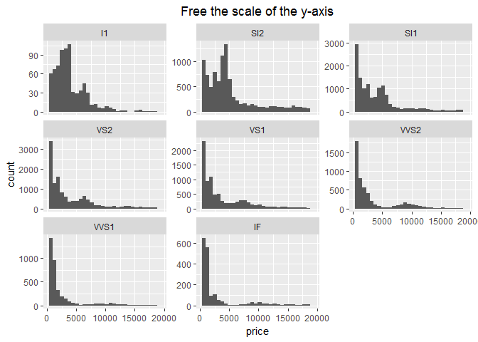

1- load the library, and the diamonds dataset
=============================================

Note that ggplot works in layers, meaning that we can plot the data and put different layers on top of the plot. This is done by using the (+) sign
---------------------------------------------------------------------------------------------------------------------------------------------------

``` r
library(ggplot2)
data("diamonds")
head(diamonds)
```

    ## # A tibble: 6 × 10
    ##   carat       cut color clarity depth table price     x     y     z
    ##   <dbl>     <ord> <ord>   <ord> <dbl> <dbl> <int> <dbl> <dbl> <dbl>
    ## 1  0.23     Ideal     E     SI2  61.5    55   326  3.95  3.98  2.43
    ## 2  0.21   Premium     E     SI1  59.8    61   326  3.89  3.84  2.31
    ## 3  0.23      Good     E     VS1  56.9    65   327  4.05  4.07  2.31
    ## 4  0.29   Premium     I     VS2  62.4    58   334  4.20  4.23  2.63
    ## 5  0.31      Good     J     SI2  63.3    58   335  4.34  4.35  2.75
    ## 6  0.24 Very Good     J    VVS2  62.8    57   336  3.94  3.96  2.48

2- Scatter Plot
===============

Simple scatter plot between the "carat" and the "price". The layer for scatterplot is "geom\_point()"
-----------------------------------------------------------------------------------------------------

``` r
ggplot(diamonds, aes(x=carat, y=price)) + geom_point()
```

 \#\# To change the default value of the x-label and add a title, we add more layers to the plot "xlab()" and "ggtitle()"

``` r
#to center the title use: theme(plot.title = element_text(hjust = 0.5))
ggplot(diamonds, aes(x=carat, y=price)) + geom_point() + ggtitle("My Scatter plot") + xlab("carat (weight)") + theme(plot.title = element_text(hjust = 0.5))
```



To add a limit for x-axis and y-axis use "xlim(), ylim()" layers. For exapmle, limit x(carat) between 0,2 and y(price) between 0, 10000$
----------------------------------------------------------------------------------------------------------------------------------------

``` r
#Note that this action can cause data loss in the plot
ggplot(diamonds, aes(x=carat, y=price)) + geom_point() + xlab("carat (weight)") + xlim(0,2) + ylim(0,10000) 
```

    ## Warning: Removed 5316 rows containing missing values (geom_point).


To put one of the axes in log scale, for example the y-axis, use "scale\_y\_log10()" layer
------------------------------------------------------------------------------------------

``` r
ggplot(diamonds, aes(x=carat, y=price)) + geom_point() + scale_y_log10()
```



Add additional feature in the plot by using color, for example add "clarity"
----------------------------------------------------------------------------

``` r
ggplot(diamonds, aes(x=carat, y=price, color=clarity)) + geom_point() + xlab("carat (weight)") 
```


What about the "cut", can we add it too...Yes by the point shape
----------------------------------------------------------------

``` r
ggplot(diamonds, aes(x=carat, y=price, color=clarity, shape=cut)) + geom_point() + xlab("carat (weight)") 
```


Or the point size, but as we can see, its not a good idea for this dense data
-----------------------------------------------------------------------------

``` r
ggplot(diamonds, aes(x=carat, y=price, color=clarity, size=cut)) + geom_point() + xlab("carat (weight)") 
```

    ## Warning: Using size for a discrete variable is not advised.


We can add a smooth curve (additional layer) to show the general trend of the data. Don't forget, we do this by the (+) sign.
-----------------------------------------------------------------------------------------------------------------------------

``` r
# the gray area around the curve is the confidence interval. 
#To turn it off we can turn off the standard error option in geo_smooth(next figure).
ggplot(diamonds, aes(x=carat, y=price)) + geom_point() + geom_smooth() 
```

    ## `geom_smooth()` using method = 'gam'



``` r
# Remove the confidence area around the curve
ggplot(diamonds, aes(x=carat, y=price)) + geom_point() + geom_smooth(se=FALSE) 
```

    ## `geom_smooth()` using method = 'gam'


We also can add the best fit line for that data, by changing the method that geom\_smooth is using.
---------------------------------------------------------------------------------------------------

``` r
ggplot(diamonds, aes(x=carat, y=price)) + geom_point() + geom_smooth(se=FALSE, method="lm") 
```


We can get a smooth curve that represnts the data with respect to a specific feature rather than a one curve for all the data. For example see the data curves wrt clarity. To do that, add "color = clarity" in the "aes()"
----------------------------------------------------------------------------------------------------------------------------------------------------------------------------------------------------------------------------

``` r
ggplot(diamonds, aes(x=carat, y=price, color=clarity)) + geom_point() + geom_smooth(se=FALSE)
```

    ## `geom_smooth()` using method = 'gam'


We can only show the curves layer without the scattered points, by simply removing the "geom\_point()" layer.
-------------------------------------------------------------------------------------------------------------

``` r
ggplot(diamonds, aes(x=carat, y=price, color=clarity)) + geom_smooth(se=FALSE)
```

    ## `geom_smooth()` using method = 'gam'



We can do the same using lines ....
-----------------------------------

``` r
ggplot(diamonds, aes(x=carat, y=price, color=clarity)) + geom_point() + geom_smooth(se=FALSE, method = "lm")
```



``` r
ggplot(diamonds, aes(x=carat, y=price, color=clarity)) + geom_smooth(se=FALSE, method = "lm")
```


3- Using Faceting with Scatter plots
====================================

Faceting is to divide the plot into smaller ones wrt some attribute/feature. Back to the original scatter plot.
---------------------------------------------------------------------------------------------------------------

``` r
ggplot(diamonds, aes(x=carat, y=price, color = clarity)) + geom_point()
```


We can divide it into smaller scatter plots in terms of "clarity" by adding the "facet\_wrap()" layer, and specifiny the feature that we want to use to divide the plot, in this case "~clarityS". Note that, clarity is a measurement of how clear the diamond is (I1 (worst), SI1, SI2, VS1, VS2, VVS1, VVS2, IF (best))
--------------------------------------------------------------------------------------------------------------------------------------------------------------------------------------------------------------------------------------------------------------------------------------------------------------------------

``` r
ggplot(diamonds, aes(x=carat, y=price)) + geom_point() + facet_wrap(~clarity) 
```


We can also use scatter plot "color", to visualize an additional feature. For example, the diamond color "color" , from J (worst) to D (best). Don't get confused between the two "color", one is the plot method, and the other is just a feature from the dataset.
--------------------------------------------------------------------------------------------------------------------------------------------------------------------------------------------------------------------------------------------------------------------

``` r
ggplot(diamonds, aes(x=carat, y=price, color=color)) + geom_point() + facet_wrap(~clarity)
```



What if we want to DIVIDE the big plot into smaller one using two features(clarity & color) instead of one(color only). Use facet\_grid(color~clarity). "color~clarity" means color explaned by clarity.
--------------------------------------------------------------------------------------------------------------------------------------------------------------------------------------------------------

``` r
ggplot(diamonds, aes(x=carat, y=price)) + geom_point() + facet_grid(color~clarity)
```


We can also add the "cut" feature to this mega plot, do you know how....Yes, use color, or shape, or size for the scattered points. We will use "color". Note, this plot has "carat" on the x-axis, "price" on the y-axis, has 8\*7 subplots to specify the different "clarities" and "colors", also has a colored points to see the different "cuts". 5 Features in one plot. Amazing ha.
------------------------------------------------------------------------------------------------------------------------------------------------------------------------------------------------------------------------------------------------------------------------------------------------------------------------------------------------------------------------------------------

``` r
#to center the title use: theme(plot.title = element_text(hjust = 0.5))
ggplot(diamonds, aes(x=carat, y=price, color=cut)) + geom_point() + facet_grid(color~clarity)+ ggtitle("5 in 1 Plot") + theme(plot.title = element_text(hjust = 0.5))
```


Now we want to add a title for this plot by Using a title layer "ggtitle()".
----------------------------------------------------------------------------

``` r
ggplot(diamonds, aes(x=carat, y=price, color=cut)) + geom_point() + facet_grid(color~clarity) 
```


4- Histogram
------------

We can plot a histogram for a single feature by adding "geom\_histogram()" layer.
---------------------------------------------------------------------------------

``` r
#plot a histogram for the price feature, where the x-axis is th proce and the y-axis is the frequency "the count"
ggplot(diamonds, aes(x=price)) + geom_histogram()
```

    ## `stat_bin()` using `bins = 30`. Pick better value with `binwidth`.


control the bin width using "binwidth" inside the "geom\_histogram"
-------------------------------------------------------------------

``` r
ggplot(diamonds, aes(x=price)) + geom_histogram(binwidth = 200 ) + ggtitle("Thinner bins") + theme(plot.title = element_text(hjust = 0.5))
```


4- Using Faceting with Histograms
=================================

We can divide the big histogram the represents the whole data into smaller ones with respect to some feature, using "facet\_wrap(~ feature\_name)". For example, we can divide the histogram above wrt "clarity"
----------------------------------------------------------------------------------------------------------------------------------------------------------------------------------------------------------------

``` r
ggplot(diamonds, aes(x=price)) + geom_histogram() + facet_wrap(~ clarity) + ggtitle("Divided by the diamond clarity") + theme(plot.title = element_text(hjust = 0.5)) 
```

    ## `stat_bin()` using `bins = 30`. Pick better value with `binwidth`.

 \#\# You can see in the previous figure that the "I1" histogram count is not clear (top left one) because we use the same scale in the y-axis. To change that we can add "free\_y" option into the "facet\_wrap()" layer.

``` r
ggplot(diamonds, aes(x=price)) + geom_histogram() + facet_wrap(~ clarity, scale="free_y") + ggtitle("Free the scale of the y-axis") + theme(plot.title = element_text(hjust = 0.5))
```

    ## `stat_bin()` using `bins = 30`. Pick better value with `binwidth`.



Another cool thing to do is to make a STACK HISTOGRAM. we can fill the bins of the histogram with different colors to represent the distribution of other feature.
------------------------------------------------------------------------------------------------------------------------------------------------------------------

``` r
ggplot(diamonds, aes(x=price, fill=clarity)) + geom_histogram() + ggtitle("Fill the histogram wrt clarity") + theme(plot.title = element_text(hjust = 0.5))
```

    ## `stat_bin()` using `bins = 30`. Pick better value with `binwidth`.


We can get the density curve of the distribution by using "geom\_density" layer instead of "geom\_histogram"
------------------------------------------------------------------------------------------------------------

``` r
ggplot(diamonds, aes(x=price)) + geom_density() + ggtitle("The density Curve") + theme(plot.title = element_text(hjust = 0.5))
```


To compare multiple distributions wrt some feature, use "color=feature\_name" in the "aes"
------------------------------------------------------------------------------------------

``` r
ggplot(diamonds, aes(x=price, color=cut)) + geom_density() + ggtitle("Each curve represents different cut value") + theme(plot.title = element_text(hjust = 0.5))
```

 \#\# we can also divide put each curve into a separate plot.

``` r
ggplot(diamonds, aes(x=price)) + geom_density() + facet_wrap(~ cut) + ggtitle("Each plot represents different cut value") + theme(plot.title = element_text(hjust = 0.5))
```


