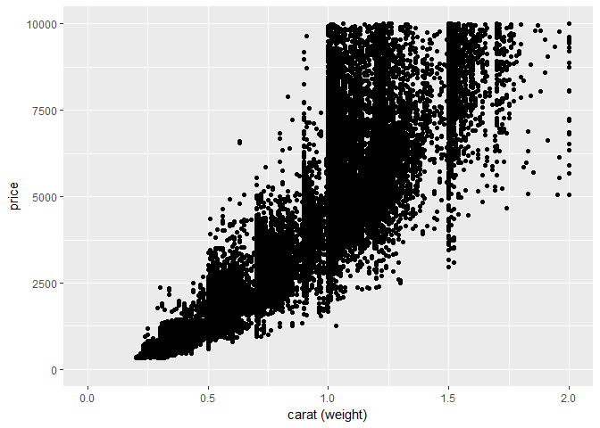

1- load the library, and the diamonds dataset
=============================================

Note that ggplot works in layers, meaning that we can plot the data and put different \#\# layers on top of the plot. This is done by using the (+) sign
--------------------------------------------------------------------------------------------------------------------------------------------------------

``` r
library(ggplot2)
data("diamonds")
head(diamonds)
```

    ## # A tibble: 6 × 10
    ##   carat       cut color clarity depth table price     x     y     z
    ##   <dbl>     <ord> <ord>   <ord> <dbl> <dbl> <int> <dbl> <dbl> <dbl>
    ## 1  0.23     Ideal     E     SI2  61.5    55   326  3.95  3.98  2.43
    ## 2  0.21   Premium     E     SI1  59.8    61   326  3.89  3.84  2.31
    ## 3  0.23      Good     E     VS1  56.9    65   327  4.05  4.07  2.31
    ## 4  0.29   Premium     I     VS2  62.4    58   334  4.20  4.23  2.63
    ## 5  0.31      Good     J     SI2  63.3    58   335  4.34  4.35  2.75
    ## 6  0.24 Very Good     J    VVS2  62.8    57   336  3.94  3.96  2.48

2- Scatter Plot
===============

Simple scatter plot between the "carat" and the "price"
-------------------------------------------------------

``` r
ggplot(diamonds, aes(x=carat, y=price)) + geom_point() + ggtitle("Scatter plot") + xlab("carat (weight)") 
```


Add additional feature in the plot by using color, for example add "clarity"
----------------------------------------------------------------------------

``` r
ggplot(diamonds, aes(x=carat, y=price, color=clarity)) + geom_point() + ggtitle("Scatter plot") + xlab("carat (weight)") 
```


What about the "cut", can we add it too...Yes by the point shape
----------------------------------------------------------------

``` r
ggplot(diamonds, aes(x=carat, y=price, color=clarity, shape=cut)) + geom_point() + ggtitle("Scatter plot") + xlab("carat (weight)") 
```



Or the point size, but as we can see, its not a good idea for this dense data
-----------------------------------------------------------------------------

``` r
ggplot(diamonds, aes(x=carat, y=price, color=clarity, size=cut)) + geom_point() + ggtitle("Scatter plot") + xlab("carat (weight)") 
```

    ## Warning: Using size for a discrete variable is not advised.


We can add a smooth curve (additional layer) to show the general trend of the data. Don't forget, we do this by the (+) sign.
-----------------------------------------------------------------------------------------------------------------------------

``` r
# the gray area around the curve is the confidence interval. 
#To turn it off we can turn off the standard error option in geo_smooth(next figure).
ggplot(diamonds, aes(x=carat, y=price)) + geom_point() + geom_smooth() 
```

    ## `geom_smooth()` using method = 'gam'


``` r
# Remove the confidence area around the curve
ggplot(diamonds, aes(x=carat, y=price)) + geom_point() + geom_smooth(se=FALSE) 
```

    ## `geom_smooth()` using method = 'gam'


We also can add the best fit line for that data, by changing the method that geom\_smooth is using.
---------------------------------------------------------------------------------------------------

``` r
ggplot(diamonds, aes(x=carat, y=price)) + geom_point() + geom_smooth(se=FALSE, method="lm") 
```


We can get a smooth curve that represnts the data with respect to a specific feature rather than a one curve for all the data. For example see the data curves wrt clarity. To do that, add "color = clarity" in the "aes()"
----------------------------------------------------------------------------------------------------------------------------------------------------------------------------------------------------------------------------

``` r
ggplot(diamonds, aes(x=carat, y=price, color=clarity)) + geom_point() + geom_smooth(se=FALSE)
```

    ## `geom_smooth()` using method = 'gam'


We can only show the curves layer without the scattered points, by simply removing the "geom\_point()" layer.
-------------------------------------------------------------------------------------------------------------

``` r
ggplot(diamonds, aes(x=carat, y=price, color=clarity)) + geom_smooth(se=FALSE)
```

    ## `geom_smooth()` using method = 'gam'


We can do the same using lines ....
-----------------------------------

``` r
ggplot(diamonds, aes(x=carat, y=price, color=clarity)) + geom_point() + geom_smooth(se=FALSE, method = "lm")
```


``` r
ggplot(diamonds, aes(x=carat, y=price, color=clarity)) + geom_smooth(se=FALSE, method = "lm")
```


